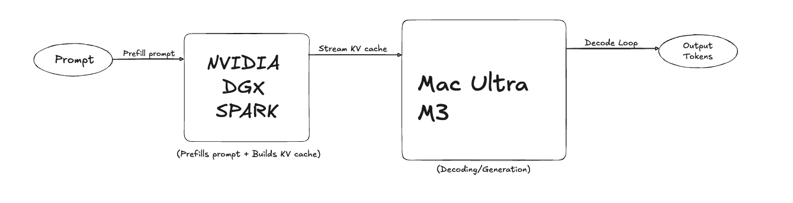
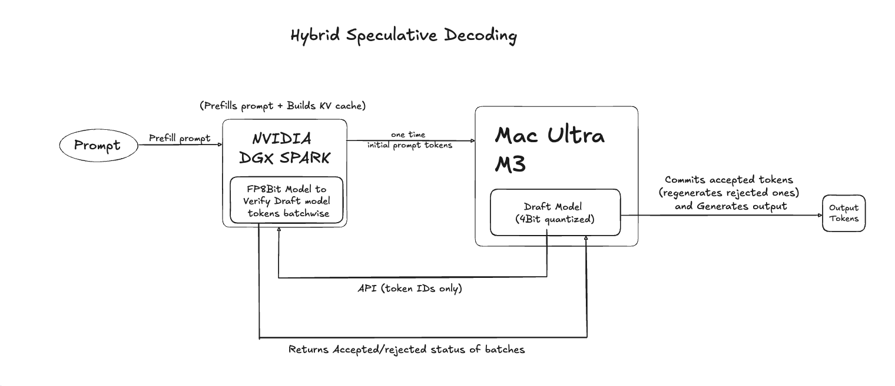

# hetero_specdecode - Heterogeneous Speculative Decoding

This prototype demonstrates speculative decoding across heterogeneous hardware:
- **DGX/Server (verifier)**: Higher-precision model (Q8_0) for verification
- **Mac M3 Ultra  (drafter)**: Lower-precision model (Q4_K_M) for fast draft generation

## Why This Approach?

**Alternative approach** (prefill/decode split): Some implementations split inference by having DGX do prefill and Mac do decode, streaming the KV cache between them. This requires:
- ❌ 10GbE network (expensive)
- ❌ Streaming 500MB-2GB KV cache per request
- ❌ Complex KV serialization/deserialization
- ❌ DGX sits idle during decode phase

Here is a diagram of this "split-pipe" architecture...



**Our approach** (speculative decoding): Both machines work continuously with minimal coordination:
- ✅ Works on standard network (1GbE/WiFi)
- ✅ Only 20-50 bytes transferred per iteration (token IDs only)
- ✅ No KV cache streaming needed
- ✅ Both machines fully utilized (90%+ utilization)
- ✅ 2x measured speedup with simple implementation

This new architecture solves the bottleneck...




### Key Insight: KV Cache Doesn't Need to Move

Each machine maintains its own KV cache independently. Only small token IDs (~4 integers) are exchanged for verification. This eliminates the network bottleneck entirely.

## Overview

Speculative decoding accelerates LLM inference by:
1. **Drafting** multiple tokens quickly with a smaller/quantized model (Mac M3)
2. **Verifying** drafts in parallel with a larger/precise model (DGX/Server)
3. **Accepting** matching tokens and continuing generation

**Benefits**: 
- 1.5-3x speedup with high acceptance rates (typically 40-80%)
- Minimal network overhead (~50 bytes per iteration vs 500MB+ for KV streaming)
- Full hardware utilization (both machines busy throughout)

---

## Requirements

- **Python**: 3.11+
- **Hardware**: 
  - Mac with Apple Silicon (M1/M2/M3/M4) for Metal acceleration
  - Any machine with GPU for the server (or CPU if no GPU available)

---

## Setup Instructions

### 1. Download Models

Both client and server need the TinyLlama GGUF models:

```bash
# Create models directory
mkdir -p models
cd models

# Download 4-bit model (for Mac drafter - ~637 MB)
wget https://huggingface.co/TheBloke/TinyLlama-1.1B-Chat-v1.0-GGUF/resolve/main/tinyllama-1.1b-chat-v1.0.Q4_K_M.gguf

# Download 8-bit model (for server verifier - ~1.1 GB)
wget https://huggingface.co/TheBloke/TinyLlama-1.1B-Chat-v1.0-GGUF/resolve/main/tinyllama-1.1b-chat-v1.0.Q8_0.gguf

cd ..
```

**Note**: Place the models in a `models/` directory in both `DGX_Spark/` and `Mac_Studio/` folders (or use symlinks).

---

### 2. Server Setup (DGX/Verifier)

```bash
cd DGX_Spark

# Create virtual environment
python3 -m venv venv_dgx
source venv_dgx/bin/activate

# Install dependencies
pip install llama-cpp-python fastapi uvicorn

# For GPU support (optional, if you have CUDA):
# CMAKE_ARGS="-DLLAMA_CUBLAS=on" pip install llama-cpp-python --force-reinstall --no-cache-dir

# Start the server
uvicorn main:app --host 127.0.0.1 --port 8000
```

**Expected output**:
```
INFO:     Started server process
INFO:     Waiting for application startup.
INFO:     Application startup complete.
INFO:     Uvicorn running on http://127.0.0.1:8000
```

---

### 3. Client Setup (Mac M3/Drafter)

Open a new terminal:

```bash
cd Mac_Studio

# Create virtual environment
python3 -m venv venv_mac
source venv_mac/bin/activate

# Install dependencies with Metal support
CMAKE_ARGS="-DLLAMA_METAL=on" pip install -r requirements.txt

# Run the drafter client
python draft_token_generator.py \
    --dgx http://127.0.0.1:8000 \
    --prompt "best sport in the world is" \
    --draft_n 4 \
    --max_tokens 80
```

---

## Usage

### Basic Command

```bash
python draft_token_generator.py \
    --dgx http://127.0.0.1:8000 \
    --prompt "Your prompt here" \
    --draft_n 4 \
    --max_tokens 80
```

### Parameters

- `--dgx`: Server URL (default: `http://127.0.0.1:8000`)
- `--model`: Path to draft model GGUF file (default: `tinyllama-1.1b-chat-v1.0.Q4_K_M.gguf`)
- `--prompt`: Input prompt text
- `--draft_n`: Number of tokens to draft per iteration (default: 4)
- `--max_tokens`: Maximum tokens to generate (default: 80)

---

## Example Output

```
Loading 4-bit model: tinyllama-1.1b-chat-v1.0.Q4_K_M.gguf
✓ Model loaded

Prompt: best sport in the world is
✓ Prefill done (7 tokens)

Iter 1: 7/80 tokens
  Current context preview: ...'best sport in the world is'
  Generated text: ' cricket.\n'
  Draft tokens: [259, 699, 3522, 29889, 13]
  Draft text: '  cricket.\n'
  ✅ 5/5 accepted: '  cricket.\n'

Iter 2: 12/80 tokens
  Current context preview: ...'best sport in the world is  cricket.\n'
  Generated text: '\n2. Cr'
  Draft tokens: [29871, 13, 29906, 29889, 6781]
  Draft text: ' \n2. Cr'
  ✅ 5/5 accepted: ' \n2. Cr'

Iter 3:...

============================================================
SPECULATIVE DECODING RESULTS
============================================================

📊 Generation Stats:
   Prompt tokens:        7
   Generated tokens:     75
   Total tokens:         82
   Iterations:           20

⚡ Performance:
   Total time:           2.37s
   Throughput:           31.6 tok/s

🎯 Speculative Decoding Efficiency:
   Tokens drafted:       97
   Tokens accepted:      75
   Acceptance rate:      77.3%
   Avg tokens/iteration: 3.75

🚀 Speedup Analysis:
   Speculative:          31.6 tok/s
   Est. Sequential:      15.8 tok/s
   Speedup:              2.00x faster

============================================================
```

---

## Architecture

### High-Level Flow

```
┌─────────────────┐                    ┌──────────────────┐
│   Mac Ultra M3  |                    |                  |
|          Client │                    │  DGX/Server      │
│   (Drafter)     │                    │  (Verifier)      │
│                 │                    │                  │
│  Q4_K_M Model   │◄──────────────────►│  Q8_0 Model      │
│  Fast Draft     │   HTTP/JSON API    │  High Precision  │
│  Generation     │   (~20-50 bytes)   │  Verification    │
└─────────────────┘                    └──────────────────┘
        │                                      │
        │  1. Generate 4 draft tokens         │
        │─────────────────────────────────────►│
        │     draft_tokens: [259, 699, ...]   │
        │                                      │
        │  2. Verify drafts, return accepted  │
        │◄─────────────────────────────────────│
        │     {accepted: 3, preds: [...]}     │
        │                                      │
        │  3. Continue from accepted tokens   │
        │─────────────────────────────────────►│
```

### Critical Architecture Details

**🔑 No KV Cache Streaming**
- Each machine maintains its own KV cache independently
- KV cache never leaves its host machine
- Both sides regenerate KV from token IDs (current_tokens list)
- Network transfer: Only token IDs (~4 integers = 20 bytes per iteration)

**⚡ Resource Utilization**
```
Traditional Approach (Prefill/Decode Split):
  DGX: ████░░░░░░░░░░░░░░ (20% - idle after prefill)
  Mac: ░░░░████████████░░ (80% - doing all decode)

Our Approach (Speculative Decoding):
  DGX: ████████████████░░ (90% - continuous verification)
  Mac: ████████████████░░ (90% - continuous drafting)
```

**📊 Network Efficiency**
- Per iteration: ~20-50 bytes (token IDs only)
- Alternative approach: 500MB-2GB (full KV cache)
- **~10,000,000x less data transferred**

### API Endpoints

#### POST `/prefill/`
Initialize the prompt and KV cache.

**Request**:
```json
{
  "prompt": "best sport in the world is"
}
```

**Response**:
```json
{
  "prompt_len": 7,
  "prompt_ids": [1, 1900, 7980, 297, 278, 3186, 338]
}
```

#### POST `/verify/`
Verify draft tokens against server predictions.

**Request**:
```json
{
  "draft_tokens": [259, 699, 3522, 29889, 13]
}
```

**Response**:
```json
{
  "accepted_prefix_len": 5,
  "preds": [259, 699, 3522, 29889, 13],
  "total_tokens": 12
}
```

---

## Performance Tips

1. **Increase `--draft_n`**: More tokens per draft = higher potential speedup (but lower acceptance rate)
   - Optimal range: 4-8 tokens
   - Too high: acceptance rate drops significantly

2. **Model Selection**: 
   - Use smaller quantization for drafter (Q4_K_M, Q4_0)
   - Use higher precision for verifier (Q8_0, FP16)
   - Similar model families = higher acceptance rates

3. **Hardware Optimization**:
   - Mac: Ensure Metal acceleration (`CMAKE_ARGS="-DLLAMA_METAL=on"`)
   - Server: Use GPU acceleration for best performance

---

## Troubleshooting

### Issue: "No such file or directory: models/tinyllama..."
**Solution**: Download models (see Setup step 1) or update model path

### Issue: Low acceptance rate (<30%)
**Solution**: Models may be too different. Try:
- Using same model family with different quantizations
- Reducing `--draft_n` to 2-3 tokens

### Issue: Slow generation on Mac
**Solution**: Verify Metal acceleration:
```bash
pip uninstall llama-cpp-python
CMAKE_ARGS="-DLLAMA_METAL=on" pip install llama-cpp-python --no-cache-dir
```

### Issue: Server returns token 0 repeatedly
**Solution**: Ensure server model is initialized with `logits_all=True` (already in provided code)

---

## Advanced: Using Different Models

### Larger Models (Mistral, Llama 2)  - for better spec decoding (you can then remove greedy generation as in current implementation)

```bash
# Download Mistral 7B (Q4_K_M for drafter, Q8_0 for server)
wget https://huggingface.co/TheBloke/Mistral-7B-Instruct-v0.2-GGUF/resolve/main/mistral-7b-instruct-v0.2.Q4_K_M.gguf
wget https://huggingface.co/TheBloke/Mistral-7B-Instruct-v0.2-GGUF/resolve/main/mistral-7b-instruct-v0.2.Q8_0.gguf

# Update model paths in code
python draft_token_generator.py --model mistral-7b-instruct-v0.2.Q4_K_M.gguf ...
```

---

## Production Considerations

### Current Implementation Benefits

1. **Network Agnostic**: Works on standard 1GbE, WiFi, or even internet
   - No need for expensive 10GbE infrastructure ($750-2600 savings)
   - No special cabling or switches required

2. **Simple Implementation**: 
   - Only token IDs (integers) exchanged
   - No complex KV cache serialization
   - Standard HTTP REST API

3. **Full Hardware Utilization**:
   - Both machines continuously processing
   - DGX verifies while Mac drafts next batch
   - No idle time waiting for large transfers

4. **Flexible Model Selection**:
   - Can use completely different model architectures
   - Mac: TinyLlama 4-bit, DGX: Mistral 8-bit (works!)
   - KV cache format incompatibility is not an issue

### Potential Optimizations

1. **Server-Side KV Caching**: Keep KV cache on server between requests to avoid recomputation
   ```python
   # Instead of regenerating from scratch each time
   app.state.kv_cache = None
   # Reuse and extend existing cache
   ```

2. **Batching**: Process multiple concurrent requests with batch verification

3. **Binary Protocol**: Replace JSON with gRPC for lower serialization overhead

4. **Connection Pooling**: Reuse HTTP connections to reduce handshake overhead

5. **Adaptive Draft Size**: Dynamically adjust `draft_n` based on acceptance rates

---

## References

- [Speculative Decoding Paper](https://arxiv.org/abs/2211.17192)
- [llama.cpp](https://github.com/ggerganov/llama.cpp)
- [llama-cpp-python](https://github.com/abetlen/llama-cpp-python)

---

## License

MIT